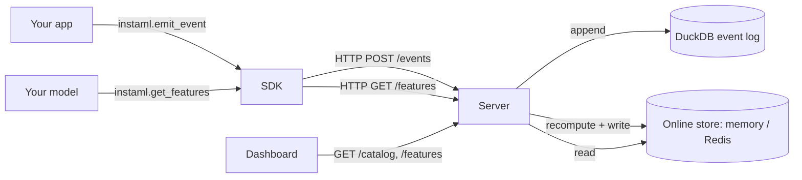

# Architecture — instaml

## High-level flow



## Components

| Component | Stack | Constraints |
|---|---|---|
| SDK (`sdk/instaml/`) | Python, httpx, pydantic, pyyaml | `emit_event` fail-soft (never breaks the caller); `get_features` degrades to `{}` on failure |
| Server (`server/`) | FastAPI | Recomputes every matching feature on each event write |
| Offline store (`server/offline/`) | DuckDB (native table, indexed on entity_id+event_type) | Source of truth for every raw event; exportable to Parquet snapshots |
| Online store (`server/online/`) | In-memory dict (default) or Redis (`INSTAML_ONLINE_URL`) | O(1) point read of the latest computed value per (entity, feature) |
| Dashboard (`server/static/`) | Static HTML, no build step | Feature catalog + live entity lookup, polls every 5s |

## Data model

```python
class Event(BaseModel):
    id: UUID
    entity_id: str
    event_type: str
    timestamp: datetime
    payload: dict[str, Any]

class FeatureDefinition(BaseModel):
    name: str
    source_event_type: str
    aggregation: Literal["count", "sum", "avg", "last", "min", "max"]
    field: str | None      # unused for count
    window: str             # "5m" / "1h" / "7d" / "lifetime"
```

## Why recompute-on-write instead of incremental aggregates

Every incoming event triggers a fresh aggregation over the matching window of
raw events (pulled from DuckDB), rather than maintaining a running counter per
feature. That's more work per write, but it's obviously correct — no risk of
a running sum drifting from reality after a bug or a restart — and DuckDB's
indexed lookups keep it fast at indie/demo event volumes. tracelens's SQLite
backend makes the same trade-off (aggregate in Python over the window) rather
than maintaining running stats.

## Why DuckDB instead of literal Parquet-file appends

Parquet is a columnar file format, not a database — there's no efficient
native "append one row" operation. Feast/Tecton-scale feature stores solve
this with a real streaming warehouse behind the offline store; for an
indie-deployable MVP, DuckDB gives the same fast-append + SQL-query
capability natively, and its `COPY ... TO 'file.parquet'` support means the
event log can still be snapshotted to Parquet on demand
(`OfflineStore.export_parquet()`) for analysis in pandas, another DuckDB
session, or a warehouse load — which is where "Parquet" in the stack actually
shows up.

## Why the online store is this dumb

`OnlineStore` only ever does point get/set of `(value, updated_at)` — no
aggregation logic lives there. That's deliberate: it's the same
`Storage`-protocol pattern tracelens uses for its SQLite/ClickHouse split,
and keeping the interface this narrow is what makes swapping in Redis (for
the hosted demo, since Fly.io's local disk doesn't share across machines) a
single new file (`_redis.py`) with zero changes anywhere else.

## Non-goals (MVP)

- Point-in-time-correct historical feature retrieval for offline training
  (real feature stores need this for training/serving skew prevention) —
  `query_events` + `export_parquet` give you the raw materials, but there's
  no training-dataset generation API yet. See ROADMAP.md.
- A real Kafka ingestion path is optional, not load-bearing — `POST /events`
  is the primary path; a Kafka-consuming adapter that forwards to the same
  handler is a roadmap item, not required for the demo.
- Feature versioning / point-in-time feature definitions — a feature's
  aggregation logic is whatever `features/demo.yaml` currently says; there's
  no historical replay if you change a definition.
